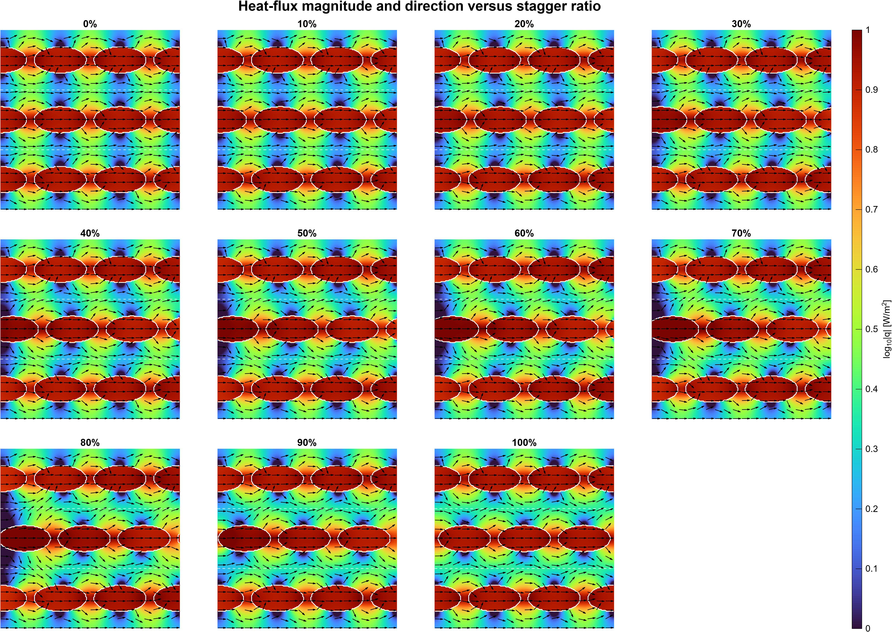
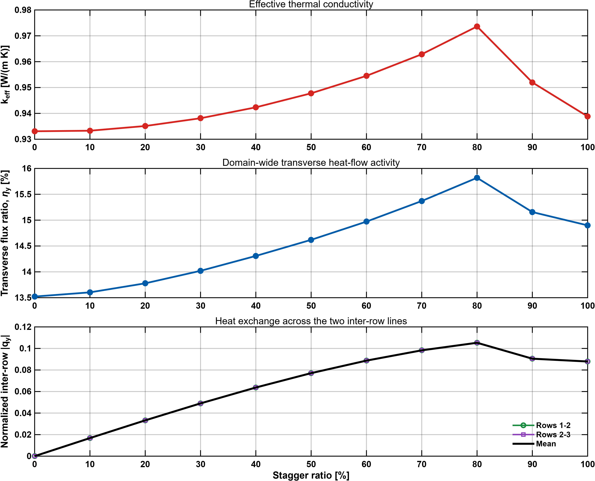
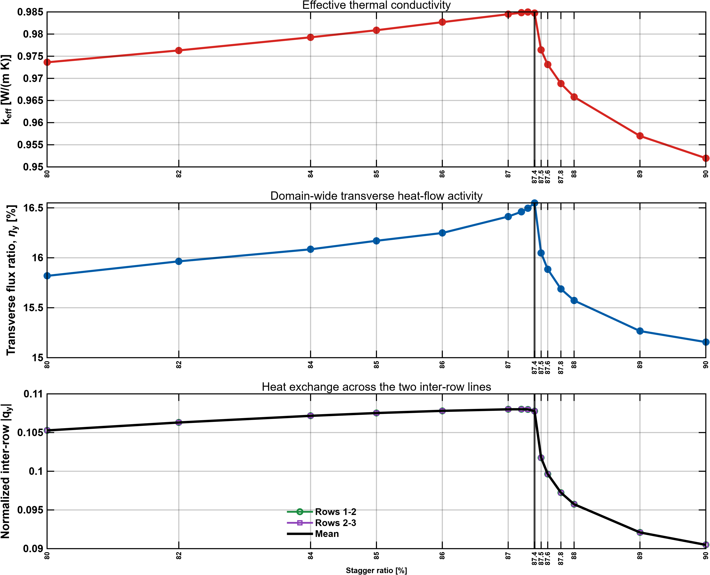

# 87.4% 이유 간단하게+총정리
## 열관리 복합소재의 열전달 거동 해석 및 제어를 위한 2차원 모델 플랫폼 설계
### 1. 우리 연구의 핵심
> 같은 구리 충진률이라도 구리가 열흐름 방향으로 어떻게 이어지고, 각 단면에 어떻게 분배되는지에 따라 유효열전도도와 국부 온도분포가 달라진다. PS와 SP 모델은 이 두 효과를 각각 이상화하여, 패턴으로 열전달을 제어하는 원리를 설명하는 도구이다.

우리 연구에서 주목하는 열유속의 방향은 $x$방향이고, $z$방향으로는 형상이 변하지 않는 2차원 문제로 취급한다.

---
### 2. PS SP
우선 87.4% 에서 피크가 나오는 이유 정리해준다고 했는데, 기존에 우리가 연구를 진행하면서 얻은 결론부터 정리해주는게 대본 작성할 때 도움이 될 것 같아서 먼저 적어볼게요.

*우선 작성하다보니 계속 용어가 바뀌는게 좀 그래서 주된 열유속의 방향을 $x$방향, $y$횡방향으로 할게요. 그리고 전도도와 저항, 흐름과 병목같이 서로 반대되는 개념이 한 문장에 들어가면 설명을 듣는 입장에서 헷갈릴 여지가 있으니까 단어사용 최대한 주의해서 주의해서 대본 적으면 좋을 것 같아요.*

식은 필요하면 적어줄게요. 일단 설명만...

* PS 모델 : 수평경로의 병목을 보는 관점

    **PS가 알려주는 설계 원리**
    
    1. 구리가 종방향으로 길게 이어질수록 수평 경로의 직렬저항이 감소한다.
    2. 동일 충진율에서 구리가 여러 조각으로 끊기거나(퍼콜레이션이 없다는거임) 경로가 우회되면 실제 효과가 작아진다.
    3. 이에 따라 종횡비가 큰 수평 타원은 원보다 $x$방향으로 구리 구간을 길게 만들어 유효열전도도를 높일 수 있다.

* SP 모델 : 수직경로의 병목을 보는 관점

    **SP가 알려주는 설계 원리**

    1. 구리가 전혀 없는 세로 단면은 $k_{\parallel}$=$k_{epoxy}$인 강한 병목으로 작용한다.
    2. 따라서 구리를 모든 $x$ 단면에 분산시키고, $\ell_{\mathrm{Cu}}^{\mathrm{min}}$과 $\ell_{\mathrm{Cu}}(x)$를 길게하는 것은 병목 완화에 유리하다.

 

---

 

**PS와 SP를 함께 보며 무엇을 제어해야 하는가**

| 관점 | 주된 변수 | 유리한 변화 |
|:---|:---:|:---:|
| PS | 수평선별 $x$방향 구리 길이와 *연속성* | 주된 경로 흐름 강화 or 에폭시 직렬저항 감소 |
| SP | 수직선별 $y$방향 구리 길이와 *연속성* | 구리 없는 수직선 제거와 그로 인한 $y$방향 열 재분배 |

PS와 SP를 통해 열전도도를 높이기 위해서는 패턴의 모양과 배치가 어떻게 되어야 하는지 1차적인 가이드라인을 알 수 있었어요.

하지만 주의해야할 점이 있어요. PS와 SP만으로는 열흐름의 경향까지만 간단하게 확인할 수 있을 뿐이라는 점이에요.

1. PS 값은 동일하지만 전도도가 다른 경우 $\rightarrow$ 대부분의 경우 SP 값을 비교하면 뭐가 더 열이 잘 흐르는지 알 수 있음.
2. 타원 엇갈림의 경우 PS는 모두 동일, SP의 경우 엇갈림이 증가할수록 SP값이 증가했지만 열전도도는 87.4%에서 꺾임

    $\rightarrow$ PS도 그렇고 SP도 그렇고 적분을 통해 나온 값이므로 완벽한 판단은 불가능함
    
    ### *그림자를 예로 들면, 같은 새 모양의 그림자이더라도 이게 진짜 새인지 손모양으로 만든 새인지 알 수 없는 것과 같음*

    ### 결론은 PS와 SP는 우리의 목표인 열거동의 제어 관점에서 가장 먼저 고려해야될 요소가 무엇인지 알 수 있게 해줬다는 것. 엇갈림과 같이 미세한 열전도도의 차이는 실제 열유속이 횡방향으로 얼마나 재분배되는지 확인해봐야함.

 

---

 

### 3. 87.4% 피크에 대한 해석

제일 최근 교수님과 면담때, [2행 타원의 이동거리=1행 타원의 반장축 길이]인 지점이 87.4%라는걸 말씀 드렸고, 그 부분에 대해서 교수님께서 흥미를 가지셨어요.

계산해본 결과 SP는 계속 늘어났지만 $k_{eff}$는 약 87.4%를 기점으로 꺾였어요.

균일도와 같은 경우에는 $k_{eff}$와 동일한 경향을 보였고, 균일도는 세로줄을 기준으로 계산되었으니까 $y$방향의 열흐름과 관련이 있을거라고 판단했어요.

결국 $x$방향으로 흐르던 열이 병목으로 인해 막히면 $y$방향으로 우회할 수 밖에 없을거고, 우회를 했을 때 효율적인 경로가 있다면 열전도도가 높아지게 되겠죠.

시뮬 돌려서 열유속을 좀 계산해봤어요.

10% 단위로 돌렸는데 이걸로는 확인하기 어려워서 시뮬결과 정리해서 그래프로 만들었어요.

 

$\eta_y$는 전체 열유속에서 횡방향 성분이 차지하는 비율이에요. 예전에 희진이가 했던 기억이 있어서 활용해봤어요

$|q_{y}|$는 1-2행과 2-3행의 사이를 통과하는 $y$방향 열유속이고, 이를 평균내서 정규화해봤어요.

$\eta_y$ 와 $|q_{y}|$ 모두 80~90% 사이 어딘가에서 피크가 나오는 모습이 확인이 됐어요. 

 

>### 엇갈림이 커질수록 인접 행에 위치한 구리 경로를 찾아 열이 $y$방향으로 이동 뒤 다시 가로방향으로 전달된다는 것
>### 87.4%, 그러니까 2행의 이동거리가 타원의 반장축 길이인 지점에서 행간 열교환을 통한 구리 경로의 활용도가 가장 높았다는 것
>### 87.4%를 넘어서면 열이 인접 행의 효율적인 경로를 찾아 이동해야 하는 우회 거리가 길어져 다시 열전도도가 감소한다는 것

 

# 찐찐찐 최종결론
>1. 동일 충진율에서도 패턴에 따라 유효열전도도와 국부 온도분포를 제어할 수 있다.
>2. PS 관점의 핵심은 $x$방향 구리 경로의 길이와 연속성이다.
>3. SP 관점의 핵심은 $y$방향 구리 분포와 가장 취약한 단면의 병목이다.
>4. 실제 2차원 열전달은 PS와 SP 사이에서 횡방향 열유속, 그리고 열전달 경로 우회가 결합되어 결정된다.
>5. 엇갈림에는 병목 완화의 이득과 종방향 중첩 감소·경로 우회의 손실 사이의 trade-off가 존재할 수 있다.
>6. 가장 강한 후속 검증은 FEM에서 $q_y$ 비율과 행간 열유속을 직접 계산하는 것이다.

이정도로 정리할 수 있을 것 같아요.

물론 내용이 많기도 하고 실제 발표에는 못써먹을 것 같긴한데 질문 들어왔을 때 이정도면 충분하지 않을까 생각하고 있어요. 선배님한테 발표점검 받을 때 제가 한번 설명드리고 괜찮은지 확인받는게 좋을 것 같네요.

아 그리고 87.4에서 피크 뜨는것도 범위 좁혀서 시뮬 돌렸는데 사진 밑에 붙여놓을게요.

